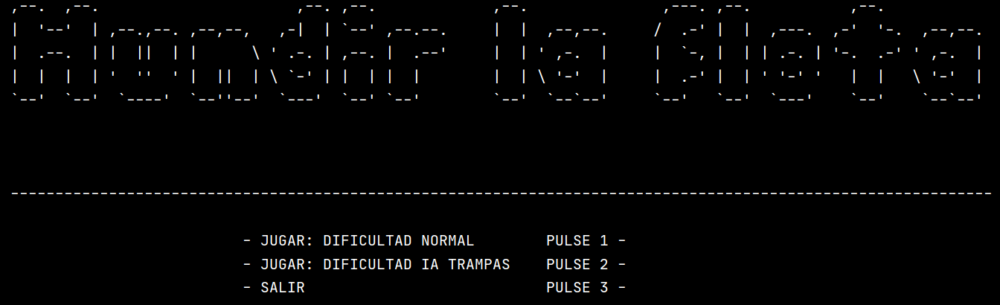

# Juego De Hundir La Flota

Versión del clásico de Hundir la flota desarrollada en Python.
Las reglas son las habituales:

- Cada jugador tiene barcos de tamaños 1,1,1,1,2,2,2,3,3,4.
- Cada barco no puede estar adyacente a otro.
- Los jugadores se intercambian los turnos para realizar disparos.

2 Dificultades implementadas:
- Normal: La IA dirige redirige su disparo una vez localiza un barco.
- Trampas: Además de lo anterior, la IA juega 2 veces en su turno.

## Capturas:
 

<i>Inicio de partida. Se puede recargar el tablero tantas veces como se quiera

<i>Después del primer turno jugando contra una IA con trampas.

<i>Jugar sin estrategia alguna.

<i>Pantalla derrota.
